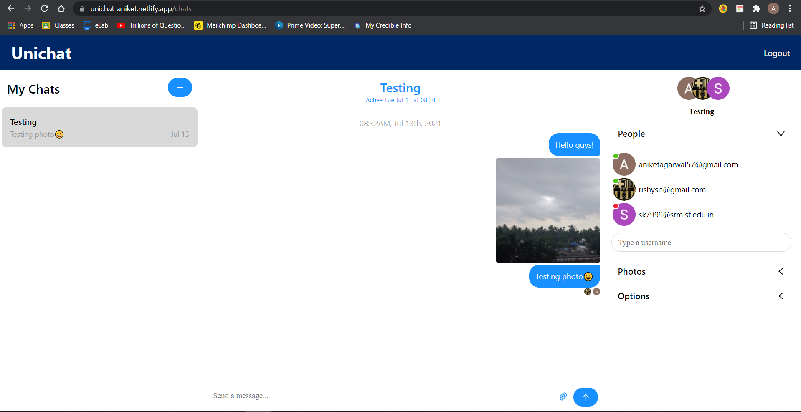

# Unichat Application

This is a simple chat application where users can login with their google account and create multiple chat rooms and send text messages and images.

## Technologies Used:
1. HTML5
2. CSS3
3. Reactjs
4. Firebase (for authentication)
5. Chat Engine (API's)

## Build and Run:
1. Download the zip file and open in some editor.
2. Login in firebase and enable Google auth and put respective API_KEY and API_ID in .env file as given in .env_sample
3. Login in Chatengine.io and create new project and copy paste respective APi_KEY and API_ID in .env file as well.
4. Run the command "npm install" in terminal to download node_modules and dependencies of react.
5. Run "npm start" in terminal and you are good to go.

## Site
Here is the deployed version of my app using netlify --> <a href="https://unichat-aniket.netlify.app/">Unichat</a>
